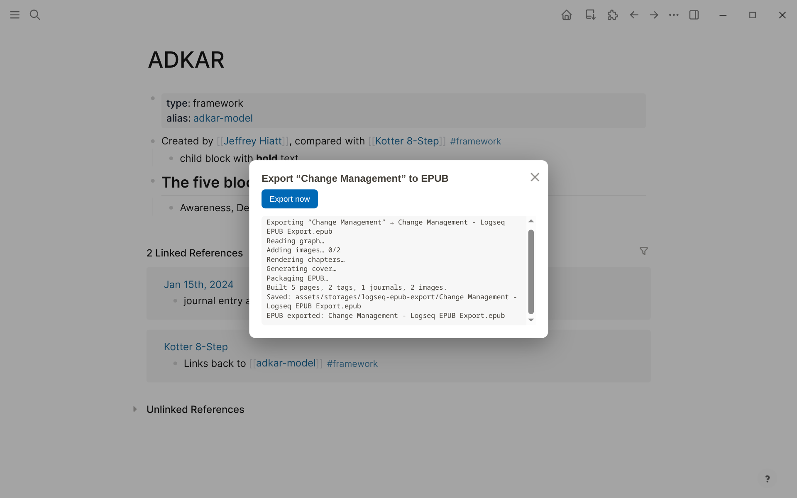
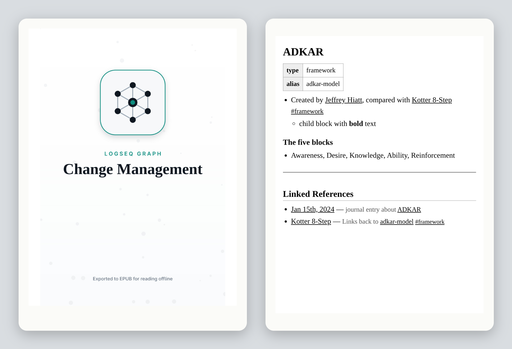

# Logseq EPUB Export

Export a whole Logseq graph to a single, navigable **EPUB** so you can read and
explore it like a wiki on an e-reader — built for **KOReader** on e-ink devices
(Boox, Kobo, Kindle, …) where Markdown files render as plain text and
`[[wikilinks]]` aren't tappable.

The toolbar icon opens a small export panel; **Export now** builds an EPUB of the
**currently selected graph** with:

- **Tap-to-navigate `[[wikilinks]]`** — resolved to internal EPUB links, aliases
  included (and a muted style for links to pages that don't exist).
- **`#tags` as browsable index chapters** — each tag lists its member pages.
- **"Linked References"** on every page — the backlinks, as working links.
- **Your images, embedded** — pictures from the graph's `assets` folder are
  packed into the book, downscaled for e-ink (see [Images](#images)).
- **`{{query (property type "X")}}` expansion** — index/MoC pages like
  `[[People]]` become real lists instead of dead macros.
- **A Home/Contents chapter** plus a grouped TOC (Pages / Tags / Journals) that
  KOReader reads natively, along with full-text search, dictionary and a
  tap-history back button.
- **An auto-generated cover** — a clean, modern, Logseq-inspired graphic
  (connected-nodes graph motif + teal accent) titled with the graph name. The
  EPUB title (`dc:title`) is the graph name too, so it lists correctly on the
  device.





<sub>Top: the panel in Logseq 0.10.15. Bottom: the exported book's cover and one
chapter, rendered with the book's own stylesheet at e-reader proportions (a browser
rendering, not a KOReader screenshot). Retake both with `npm run screenshots`.</sub>

## Contents

- [Compatibility](#compatibility)
- [How it works](#how-it-works)
- [Install](#install)
- [Usage](#usage)
- [Settings](#settings)
- [Delivering to the Boox / KOReader](#delivering-to-the-boox--koreader)
- [Images](#images)
- [Cover](#cover)
- [Limitations](#limitations)
- [Troubleshooting](#troubleshooting)
- [Development](#development)
- [Releasing](#releasing)
- [License](#license)

## Compatibility

Works on both lines of Logseq, file graphs and DB graphs. "Verified" means the
[live suite](#tests) exported a seeded graph on that build and every check on
the book passed:

| Logseq | Graph type | Status |
|---|---|---|
| **Logseq 0.10.15** (last official file-graph release) | file (Markdown) | verified: every live case passes; one reports itself skipped, because 0.10.x flags no page as built-in |
| **Logseq 2.0.1** (DB version) | DB | verified: every live case passes |
| Earlier 0.10.x releases | file | expected to work: same plugin API and data shape as 0.10.15; not in the live suite |

The suite also runs a local, unreleased build of [`logseq/og`](https://github.com/logseq/og)
(the community continuation of the file-graph line, on Electron 43) when one is
present; it passes the same cases as 0.10.15.

The two lines answer the same plugin API calls with differently shaped data —
a DB graph stores links as `[[uuid]]`, keeps headings in a property and page
properties under namespaced keys — so the plugin normalizes both before
rendering (`src/entities.ts` has the full table).

<sub>[↑ Back to contents](#contents)</sub>

## How it works

A plugin reads Logseq's database (not the raw Markdown), so block trees,
properties, aliases and tags come pre-resolved. Each page becomes one XHTML
chapter; everything is packaged into a valid EPUB 3 (with an NCX fallback) using
[JSZip](https://stuk.github.io/jszip/).

<sub>[↑ Back to contents](#contents)</sub>

## Install

**From a release:** download `logseq-epub-export-<version>.zip` from the latest
GitHub release and unzip it. In Logseq, turn on **Settings → Advanced →
Developer mode**, then **Plugins → Load unpacked plugin** and pick the unzipped
folder.

**From source:**

```sh
npm install
npm run build        # outputs ./dist
```

then **Load unpacked plugin** on this folder.

<sub>[↑ Back to contents](#contents)</sub>

## Usage

- Click the **book-download icon** in the toolbar to open the export panel. It
  names the graph, shows the custom folder (with **Change folder…**) when you
  save to one, and logs each step and message. **Export now** exports with your
  saved settings. Close it with the **×** in its corner or **Esc**.
- **`EPUB Export: open panel`** in the command palette (Ctrl+Shift+P) opens the
  same panel.
- **`EPUB Export: export current graph now`** exports directly, without the
  panel; an "Exporting…" notification shows until it's done.
- **`EPUB Export: forget export folder (this graph)`** clears the remembered
  custom folder for the open graph only; the next export asks again.

<sub>[↑ Back to contents](#contents)</sub>

## Settings

| Setting | Options | Notes |
|---|---|---|
| **Save destination** | `graph-assets` (default) · `custom-folder` | Graph-assets writes into the graph's `assets/storages/logseq-epub-export/` (see below for where that is). Custom-folder writes to a folder you choose: the first export opens a folder picker. |
| **Remember export folder** | on (default) / off | On: the folder you choose is kept for each graph, so later exports go straight there. The description names the current graph's folder. Untick it to forget every stored folder; each export then asks for a folder until you tick it again. |
| **On re-export** | `overwrite` (default) · `versioned` | Overwrite the same file, or keep history with a timestamped filename (`<graph> - Logseq EPUB Export YYYY-MM-DD-HHmm.epub`). |
| **Include journal pages** | on/off | Adds journals as their own TOC section. |
| **Output filename** | string | Blank = Calibre's naming, `<graph> - Logseq EPUB Export.epub` (see below). Anything else is used as the file name. |

### Choosing and changing the custom folder

Logseq's plugin settings have no button or folder-picker field, so the folder is
chosen during an export instead:

1. Set **Save destination** to `custom-folder`, click the toolbar icon, then
   **Export now**. A folder picker opens; choose a folder, and the export is
   saved there.
2. Later exports go straight to that folder (with **Remember export folder** on).
3. To **change** it: untick **Remember export folder** (or run
   **`EPUB Export: forget export folder (this graph)`**), and the next export
   asks again. Or open the panel and click **Change folder…**.

If an export can't open the picker by itself — it has to follow a click or key
press — the panel opens with **Choose folder and export…** instead, which does
both in one click.

The folder is stored **per graph** in the plugin's IndexedDB (a folder handle
can't live in plugin settings). This works the same whether the plugin was
loaded unpacked or installed from a release zip, because the plugin declares
`"effect": true`: Logseq then runs it in the same origin as the app, which the
folder picker and the theme-following panel need. Measured on 0.10.15 and 2.0.1:
without it the plugin is loaded cross-origin and the folder picker is blocked.

The default file name follows **Calibre's library naming**, `Title - Author.epub`:
the title is the graph name and the author is what the book declares, "Logseq
EPUB Export". A graph called *Change Management* exports as
`Change Management - Logseq EPUB Export.epub`, the same name Calibre gives the
book when you add it to a library. So a direct export and a Calibre copy match,
and KOReader, which keeps reading progress and highlights per file name, sees one
book. Like Calibre, long graph names are cut to 42 characters, accented letters
are spelled in plain ASCII (*Straße* → *Strasse*), and characters that aren't
allowed in file names become `_`. Unlike Calibre, non-Latin scripts are not
transliterated (Calibre writes 中文 as *Zhong Wen*; this plugin writes `__`).

Where **graph-assets** lands:

| Graph type | Folder |
|---|---|
| File graph (0.10.x) | `<your graph folder>/assets/storages/logseq-epub-export/` |
| DB graph (2.x) | `~/logseq/graphs/<graph name>/assets/storages/logseq-epub-export/` |

<sub>[↑ Back to contents](#contents)</sub>

## Delivering to the Boox / KOReader

Default flow for a **file graph**: keep **Save destination = graph-assets**, let
**Syncthing** carry the graph folder to the device, and open the `.epub` from
`assets/storages/logseq-epub-export/` or another selected destination in KOReader.

A **DB graph** lives in Logseq's own data folder rather than a folder you chose,
so either sync `~/logseq/graphs/<graph name>/assets/storages/logseq-epub-export/`
on its own, or switch **Save destination** to **custom-folder** and pick a folder
you already sync.

<sub>[↑ Back to contents](#contents)</sub>

## Images

Images stored in the graph are embedded in the EPUB: `` in a
file graph, and pasted or dropped images (image blocks) in a DB graph.

- **Sized for e-ink.** Anything larger than **1264 px** on its long edge is
  downscaled — about the size of a 6–7″ e-reader screen, so a phone photo doesn't
  add megabytes the device can't show.
- **In formats KOReader renders reliably.** JPEG and PNG that already fit are
  copied unchanged. Larger photos are re-encoded as JPEG, images with
  transparency stay PNG, and other formats (WebP, GIF, SVG, …) are converted.
- **Web images stay links.** `` becomes a link labelled
  `[image: alt]`: the export makes no network requests.
- An image that can't be read or decoded (a missing file, a PDF, an unsupported
  format) keeps a labelled `[image: …]` placeholder. The panel log says how
  many, and why the first one failed.

<sub>[↑ Back to contents](#contents)</sub>

## Cover

Each export auto-generates a clean, Logseq-inspired cover (a connected-nodes
graph glyph + teal accent) titled with the graph name. It's drawn on a `<canvas>`
in the plugin and embedded in the EPUB. A few things worth knowing:

- **Designed for e-ink.** Light background, near-black title and glyph, deep-teal
  accent that maps to a clean mid-gray on grayscale. Dark/flooded covers cause
  heavy ink, low contrast, and ghosting on reflective e-ink screens.
- **Written as an opaque JPEG.** This is the format crengine (KOReader's EPUB
  engine) renders most reliably — a structurally valid EPUB with an *RGBA PNG*
  cover may silently fail to display, while opaque JPEG works.
- **Maximum reader compatibility.** The cover is declared three ways so any
  reader finds it: EPUB3 `properties="cover-image"`, EPUB2
  `<meta name="cover">`, a full-page `cover.xhtml` as the first spine item, and
  an EPUB2 `<guide>` reference (used by Calibre/ADE; crengine ignores it). The
  EPUB title (`dc:title`) is the graph name, so it lists correctly on the device.

<sub>[↑ Back to contents](#contents)</sub>

## Limitations

- **Read-only snapshot** — re-run to refresh after editing the graph.
- **Web images are not downloaded**, and other assets (PDFs, audio, video) are
  not embedded; see [Images](#images).
- Block references / embeds (`((…))`, `{{embed …}}`) are not resolved.
- Only `(property <key> "<value>")` queries are expanded; other `{{query}}`
  forms render as a muted note. On DB graphs the key is matched against the
  property's **title**.
- **DB graphs:** Logseq's own properties (icons, timestamps, …) and built-in
  classes (Page, Journal, Task, …) are left out of the properties table and the
  tag index; block-level properties are not shown.
- **Images are re-encoded in the app**, one at a time; a graph with many large
  photos makes the export noticeably slower.
- **Large graphs export page by page** through the plugin API (three calls per
  page on a DB graph), so a graph with thousands of pages takes a while.

<sub>[↑ Back to contents](#contents)</sub>

## Troubleshooting

**Cover not updating in KOReader?** KOReader caches each book's cover **by file
path** on the device. If you re-export over the same filename, KOReader can keep
showing the old (or missing) thumbnail. To force a refresh: in the file browser
**long-press the book → Book information → refresh**, or **Settings → … → clear
the cover/book-info cache**. The cover *inside* the book always reflects the
latest export (it's the first page) — only the browser thumbnail is cached.
Using **versioned** output (a new filename each time) side-steps the cache
entirely.

**"Could not read the current graph."** No graph is open — on a fresh Logseq 0.10.x
profile the demo graph is not a real graph. Open or create a graph first.

**Can't find the EPUB after exporting a DB graph.** It is not next to your notes:
DB graphs live under `~/logseq/graphs/<graph name>/`. See
[Settings](#settings) for the exact folder.

**Nothing happens after choosing a folder, or "The folder picker is stuck" /
"File picker already active".** You chose a folder Logseq cannot open: the root
of **Downloads**, **Documents** or **Desktop**, or your **home folder** itself
(Chromium protects these). For such a folder Electron waits for Logseq to decide
whether to allow it, and Logseq never answers, so the picker stays stuck until
Logseq restarts. **Restart Logseq, then choose a folder *inside* one of them**,
e.g. `Downloads/EPUB`. (Checked in Electron 43.4.1's source; the plugin cannot
answer on Logseq's behalf.)

**An image shows as `[image: …]` instead of the picture.** The file could not be
read or decoded: it is missing from `assets/`, is not an image (e.g. a PDF), or
is in a format Logseq's Chromium can't decode (e.g. HEIC). The panel log counts
these and ends with a **First failure:** line naming the file, each address the
plugin tried, and what came back; please include that line when reporting a
problem. Images linked from the web are always links, by design.

**A link shows as grey text instead of a link.** The target page has no content,
so it has no chapter. Empty pages are skipped on purpose.

<sub>[↑ Back to contents](#contents)</sub>

## Development

```sh
npm run typecheck      # tsc --noEmit
npm test               # offline tests: entity normalization + render/EPUB smoke test
npm run build          # production build to ./dist
npm run test:live      # build, then drive real Logseq 0.10.15 and 2.x (local only)
npm run preview:cover  # build docs/cover-preview.js, then open docs/cover-preview.html
```

`docs/cover-preview.html` renders the generated cover in a plain browser so you
can iterate on the artwork without loading the plugin into Logseq. (`cover.ts`
uses the browser `<canvas>`/`toBlob` API, so the cover can't be rendered under
plain Node — preview it in a real browser, or screenshot `tests/cover-shot.ts`
headlessly.)

Contribution conventions are in [`CONTRIBUTING.md`](CONTRIBUTING.md).

### Tests

Two tiers, because a hand-built model cannot show what each Logseq build's API
really returns — and that difference is exactly what broke DB graphs.

**Offline (`npm test`, the CI gate).** `tests/entities.ts` checks the OG/2.x
normalization against entity shapes captured from both builds;
`tests/smoke.ts` renders a synthetic graph and packages an EPUB (mimetype first
and stored, cover declared, inline rules not re-processing each other, names with
`&`/`<`/`>` escaped but still linked); `tests/assets.ts` covers which image
paths count as graph assets (no path traversal), magic-byte type detection, the
downscale/re-encode decision and images in the EPUB manifest).

**Live (`npm run test:live`, local only).** Launches each Logseq build with an
isolated `HOME` and `--user-data-dir`, loads this repo's `dist/` as an unpacked
plugin, seeds the same small graph (Markdown files on OG, the plugin API on 2.x),
clicks the toolbar icon and the panel's **Export now** with real pointer events and takes the written EPUB
apart: container validity, well-formed XHTML (Chromium's own XML parser), book
title, page-name casing, links, aliases, `&` in names, multi-word tags, tag
indexes, backlinks, headings and nesting, properties and property queries,
journals, built-in pages left out, embedded images (a 2000 px photo arriving as
a 1264 px JPEG, a small transparent PNG kept byte-for-byte, a web image left a
link; on 2.x the images are pasted in, as a user would), the icon glyph, the File System Access API,
the custom folder (**Export now** opens the picker directly and later exports
skip it; unticking **Remember export folder** forgets the folder and makes every
export ask; an export without a click behind it falls back to the panel's
**Choose folder and export…**), and the panel following the active theme — its
background, its font (buttons included) and the accent colour, read from the
theme wrapper the way Logseq's accent picker and themes like Adwaita set it, and
updating while the panel is open. The
folder picker is replaced by one that behaves like Chromium's — refusing without
user activation — and hands back a real folder from the app's private file
system, so the export is read back from it.

On 0.10.x a fresh profile has no graph, and it only opens a folder through the
native dialog. The harness starts the app with `--inspect` and answers
`dialog.showOpenDialog` in the main process with the seeded folder, then clicks
"Choose a folder" — so the export runs against a real file graph.

It runs every build it finds, by default:

| Target | Build | Default binary | Override |
|---|---|---|---|
| `legacy` | Logseq 0.10.15, from the release's `Logseq-linux-arm64-0.10.15.zip` (check it against the release's `SHA256SUMS.txt` before extracting) | `~/.local/opt/logseq-0.10.15/Logseq` | `LOGSEQ_LEGACY_BIN` |
| `db` | Logseq 2.0.1, from `Logseq-linux-arm64-2.0.1.zip` | `~/.local/opt/logseq-db-2.0.1/logseq` | `LOGSEQ_DB_BIN` |
| `og` | a local build of `logseq/og` (optional) | `~/.local/opt/logseq-og/Logseq-OG` | `LOGSEQ_OG_BIN` |

```sh
npm run test:live -- --target=legacy,db    # the released builds only
npm run test:live -- --install=marketplace # installed like a release zip, not unpacked
LOGSEQ_LEGACY_BIN=/path/to/Logseq npm run test:live -- --target=legacy
```

`--install=marketplace` copies the build into the profile's `plugins/` folder, the
way a marketplace or release-zip install lives, instead of loading the repo
unpacked. Both install types pass the same cases.

A target whose binary is missing is skipped with a reason, never silently passed.
Run it with the screen **unlocked**: a locked session stops Logseq rendering.
Check first with `loginctl show-session "$XDG_SESSION_ID" -p LockedHint`.

<sub>[↑ Back to contents](#contents)</sub>

## Releasing

Releases are tag-driven:

1. Move `CHANGELOG.md` → `[Unreleased]` into a dated version section, and bump
   the version with `npm version <x.y.z> --no-git-tag-version` (keeps
   `package.json` and `package-lock.json` in step).
2. Run every gate, including the live suite on 0.10.15 and 2.x:
   `npm run typecheck && npm test && npm audit && npm run test:live`.
3. Merge, then tag `v<x.y.z>` on the default branch and push the tag. The
   *Release* workflow builds the plugin and attaches
   `logseq-epub-export-v<x.y.z>.zip` and `package.json` to a GitHub Release.
4. Paste the matching release notes (drafts live in `docs/releases/`).

For the Logseq marketplace, a `packages/logseq-epub-export/manifest.json` in
[`logseq/marketplace`](https://github.com/logseq/marketplace) with
`"supportsDB": true` (verified above) installs the latest release; later
releases need no marketplace PR.

<sub>[↑ Back to contents](#contents)</sub>

## License

MIT © CR0CKER
